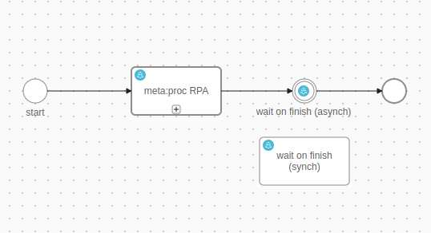

# #Roboterhaft Arbeitsgang Automatisierung (RPA) mit Meta:Proc

Die Integration von die RPA Lösung von Meta:Proc Hilft du automatisierst
genügend manuelle Tasks und verlässlich.

Diese Extension bietet an du:

- Eine Lösung gegründet weiter die meta:proc Suite von Meta:Proc
  ([Https://www.metaproc.com/en/](https://www.metaproc.com/en/))
- Kreuz-System Automatisierung ohne die Notwendigkeit für #existierend API
  Zusammenhänge
- Gebrauch verfügbar via ein bezahlt Schein Schlüssel
- Ein preconfigured Demo Ausführung für leicht Adoption in euren eigenen
  Projekten

## Demo

Der Demo Arbeitsgang exekutiert der RPA und wartet auf das Resultat.



## Einrichtung

Füg zu die Gefolgschaft `Variablen` zu eure `Variablen.yaml`:

- `Variablen.metaproc.Url`
- `Variablen.metaproc.Benutzername`
- `Variablen.metaproc.Passwort`

Und austauschen die Werte mit eurer #gegeben Einrichtung.

```
@variables.yaml@
```
